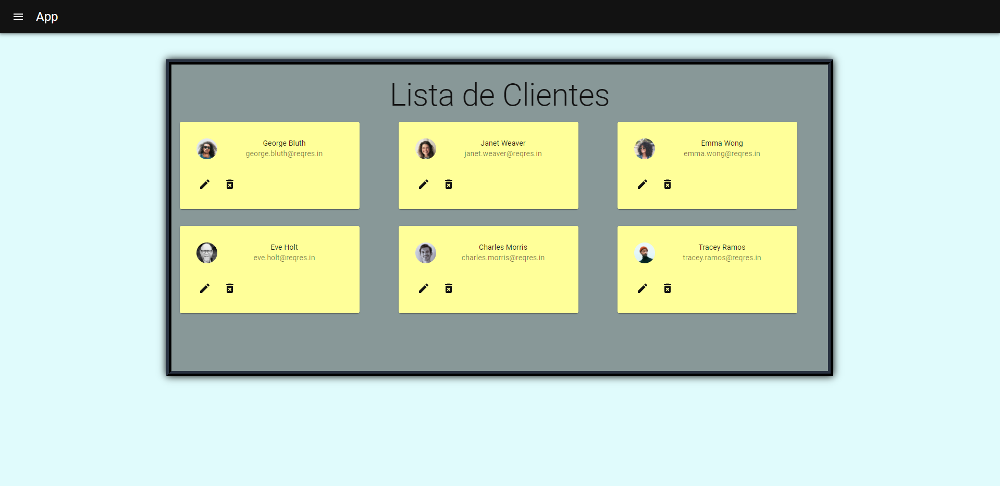
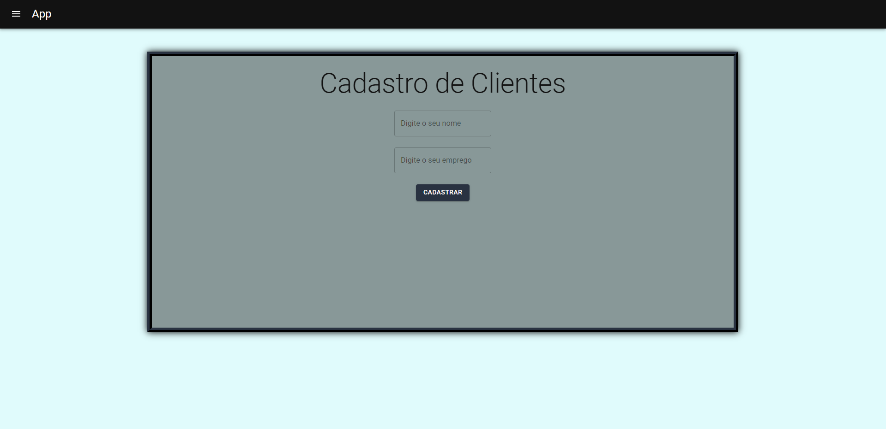
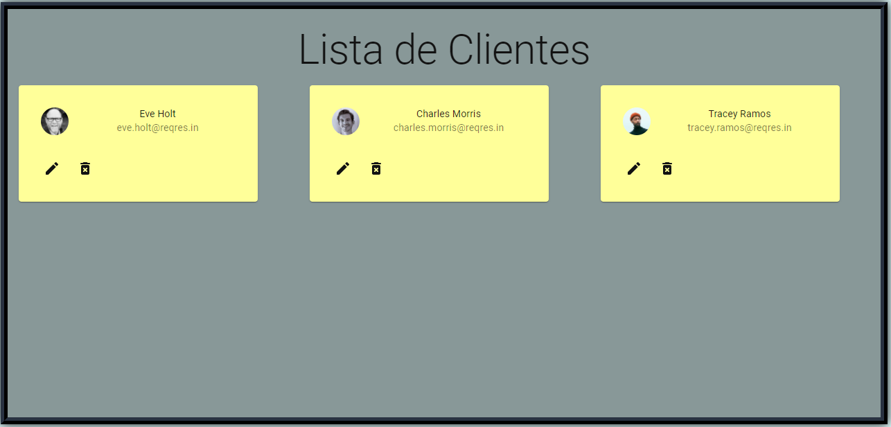
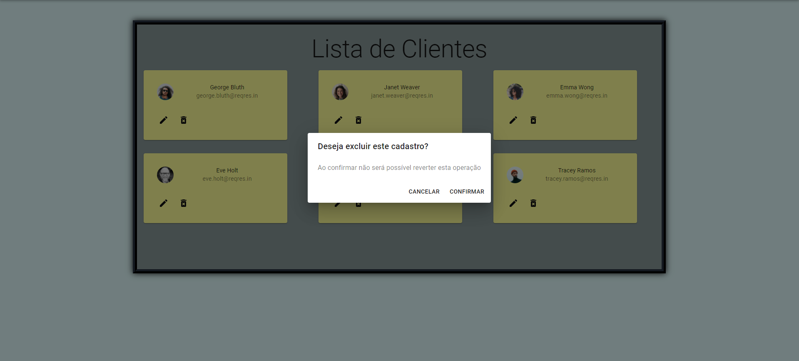

    
    <h1>Armazenamento de dados de clientes</h1>
    <h3>Aplicação de uma fake API dando retorno de clientes ficticios.</h3>

## Sobre
Por meio do **React.js** ralizei uma aplicação com controle de clientes e página de adição de novos clientes, com:
- [x] Toasty de confirmação;
- [x] Validação de preenchimento de formulário;
- [x] Utilização da biblioteca [Material-ui](https://material-ui.com/pt/);
- [x] Navegação entre páginas com o [React-Router](https://reactrouter.com/);
- [x] Modal de confirmação de exclusão dos clientes.

---

## Imagens

<h4 align="center">Cadastro de Clientes:<h4>

<h4 align="center">Remoção de Clientes:<h4>

<h4 align="center">Modal:<h4>

---

## Autor

<b>Gabriel Bittencourt Penteado 🔰</b>

Feito com 🤎 por Gabriel B. Penteado. Entre em contato! 👋🏽